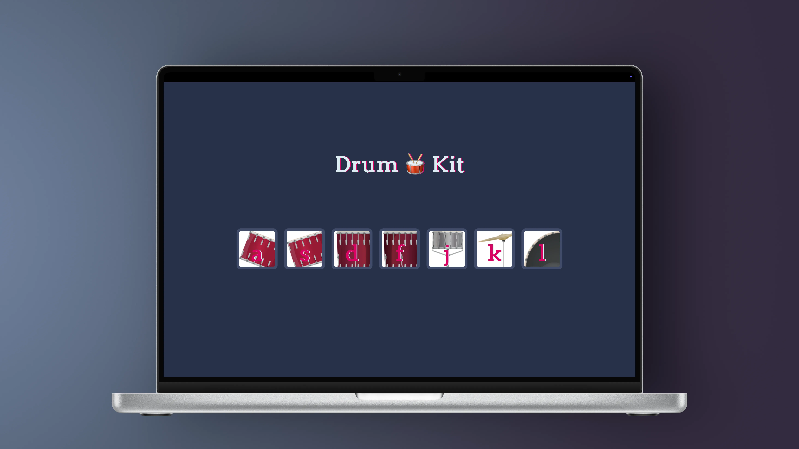

# Drum Kit

An **interactive musical web app** built with **HTML, CSS, JavaScript, and jQuery**, where users can play drum sounds by **clicking on drum pads** or by **pressing the corresponding keyboard keys**.

<p align="center">
  
</p>

<br>

---

## Project Overview

**Drum Kit** is a browser-based project designed to demonstrate **DOM manipulation** and **event handling** using **JavaScript and jQuery**.  
It highlights interactivity, user engagement, and sound playback in a clean, minimal interface.

This project demonstrates:

- Handling mouse and keyboard events using **jQuery**
- Playing audio files dynamically through the **HTML Audio API**
- Adding visual feedback and animations on user actions
- Structuring a small front-end app with readable and maintainable code

<br>

---

## Live Demo

Check out the project online here:  
[Play Drum Kit on GitHub Pages](https://mustafahabibx.github.io/drum-kit/)

<br>

---

## How to Play

1. Click on any drum pad to play its sound.
2. Alternatively, press the corresponding keyboard key to trigger it.
3. Enjoy mixing rhythms and beats in real-time.

<br>

---

## Requirements

Before running this project locally, ensure you have:

- A modern web browser (`Chrome`, `Firefox`, `Safari`, `Edge`)
- No backend or additional dependencies are required

<br>

---

## Installation & Setup

1. Clone the repository:
   ```bash
   git clone https://github.com/MustafaHabibX/drum-kit.git
   ```
2. Navigate into the project folder:
   ```bash
   cd drum-kit
   ```
3. Open `index.html` in your web browser.

(Optional: Use **VS Code** or any IDE to preview and modify the project.)

<br>

---

## Key Features

- Play drum sounds using mouse clicks or keyboard keys
- Animated drum pads for a dynamic user experience
- Built entirely with **HTML**, **CSS**, **JavaScript**, and **jQuery**
- Simple, responsive layout for all screen sizes
- Lightweight, fast, and fun to interact with

<br>

---

## Technologies

- **HTML5** – Structure of the web app
- **CSS3** – Styling and animation effects
- **JavaScript (ES6)** – Core functionality and logic
- **jQuery** – Simplified DOM manipulation and event handling
- **GitHub Pages** – Hosting live demo

<br>

---

## Learning Outcomes

By completing this project, you gain hands-on experience in:

- Using **jQuery** to simplify DOM selection and event binding
- Implementing **keyboard and mouse events** for interactivity
- Managing **audio playback** in the browser
- Adding animation and feedback for enhanced user engagement
- Writing clean, modular, and understandable JavaScript code
- Creating a fun, portfolio-ready front-end project

<br>
